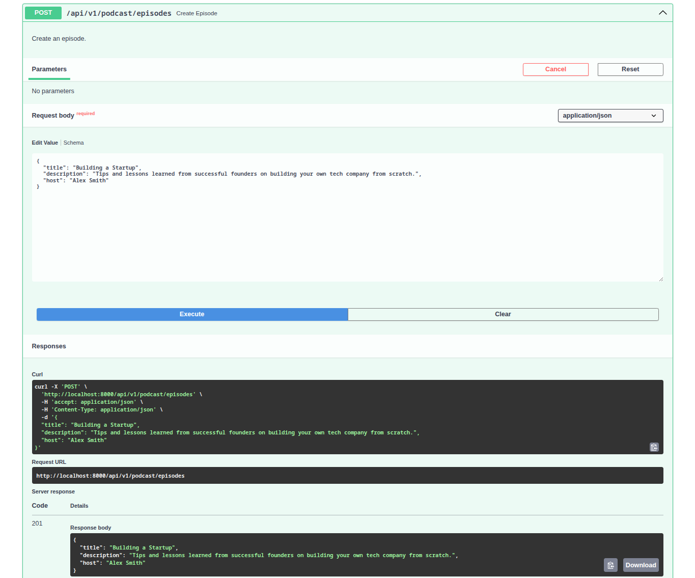
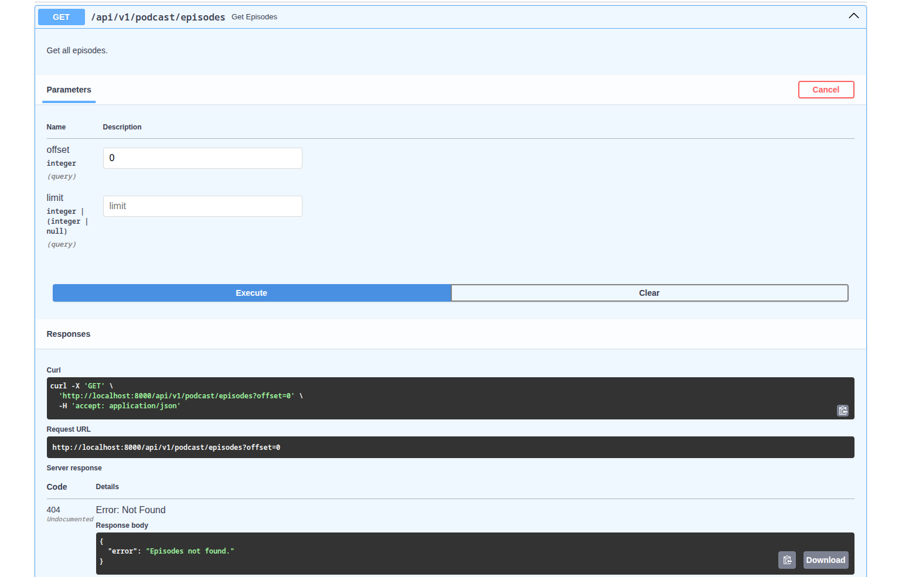
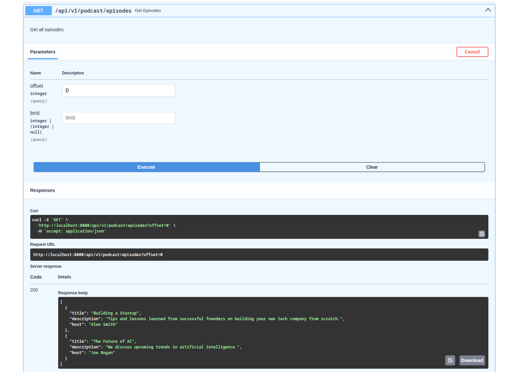
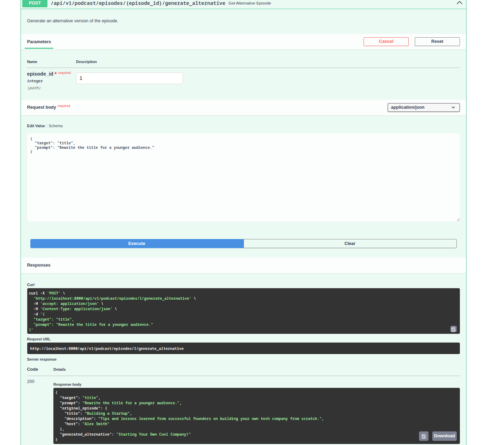
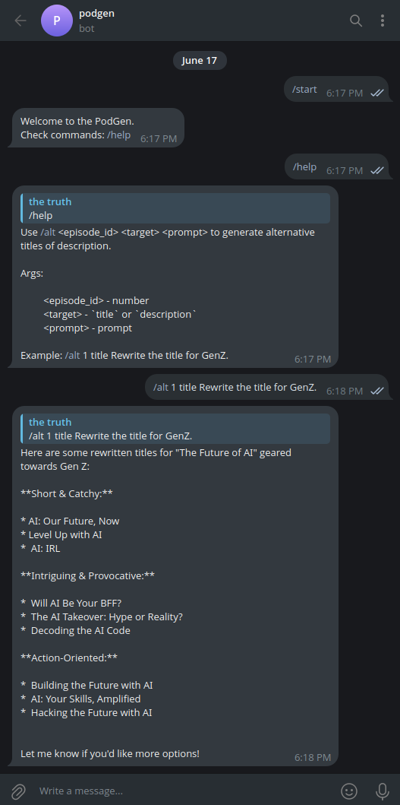
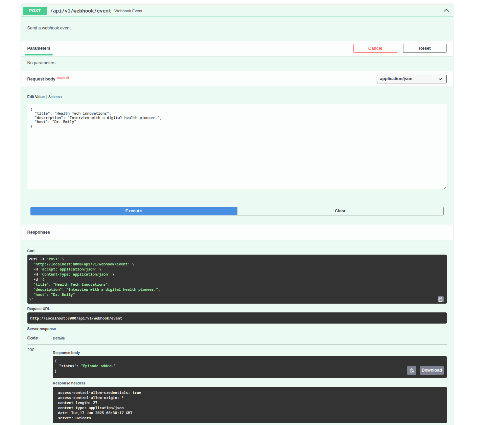
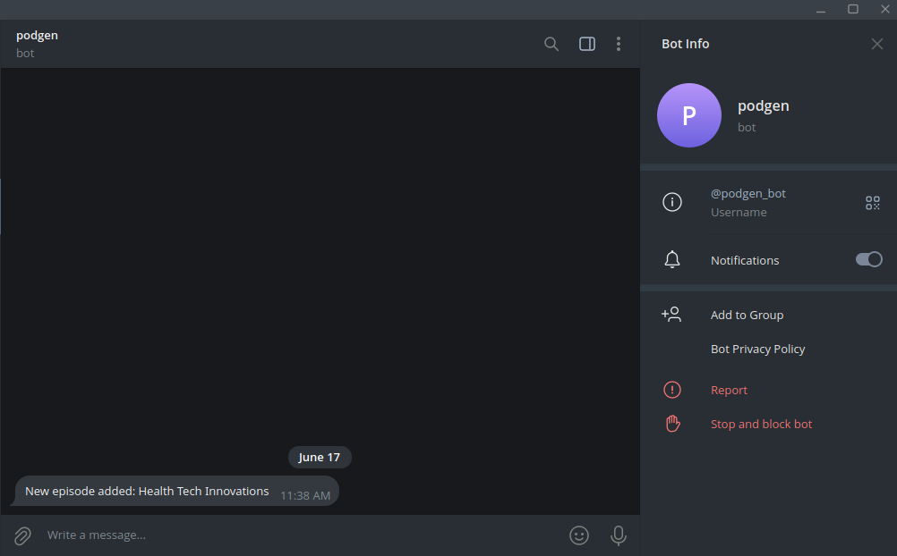
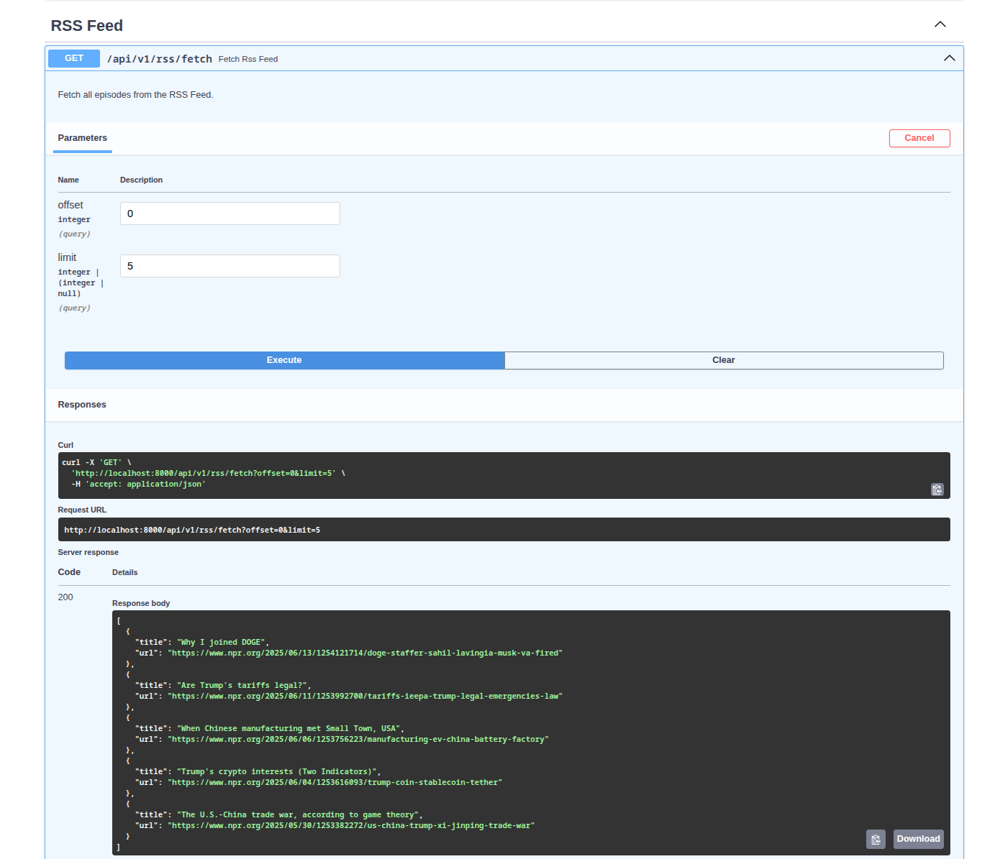
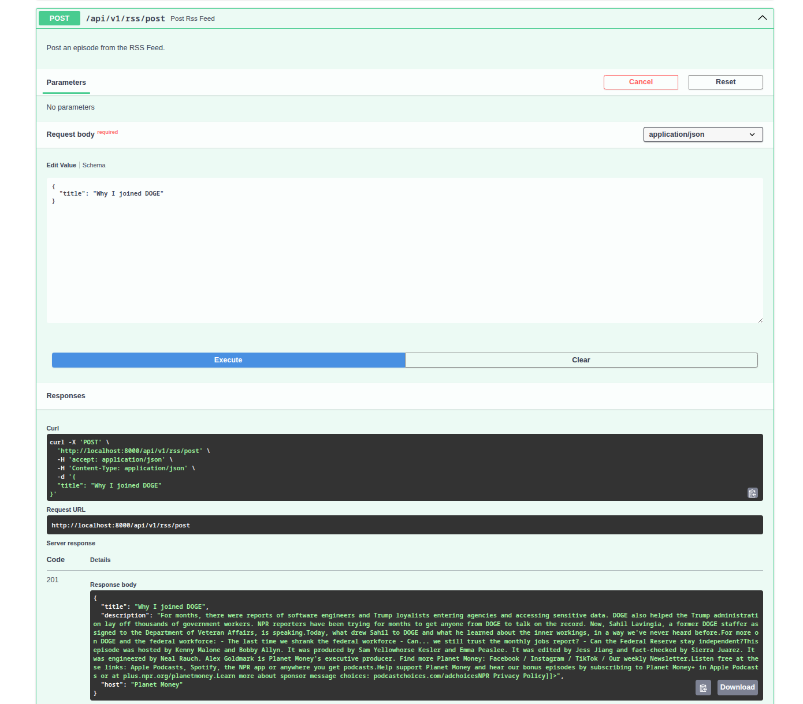
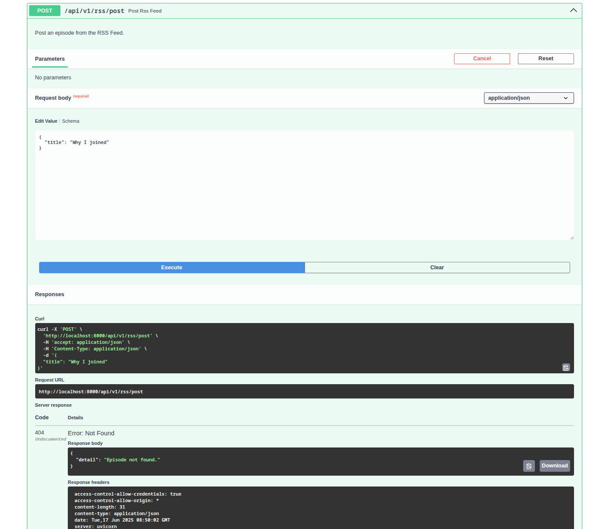

# Examples

### **Level 1: Podcast Episode CRUD**

**GOAL:**

Build a FastAPI backend with endpoints to manage a list of podcast episodes in memory DB or any other DB (SQLite, Postgre, Dynamo, doesn't matter).

**Endpoints:**

- **POST**: /api/v1/podcast/episodes: Add a podcast episode to the list.

- **GET**: /api/v1/podcast/episodes: Return a list of all podcast episodes.

### **Level 2: LLM Alternative Title/Description Generation**

**GOAL:**

Add an endpoint that takes an existing podcast episode (by ID) and uses a free LLM API to generate an alternative version of its title or description (for example, to target a different audience, change the style, or summarize).

**Endpoints:**

- **POST**: /api/v1/podcast/{episode_id}/generate_alternative

### **Level 3: Telegram Bot Integration**

**GOAL**

Create a Telegram bot that connects to your backend and generates alternative podcast episode titles or descriptions on request.

**Endpoints:**

- **/alt**: /alt 1 title Rewrite the title for GenZ.

### **Level 4: Webhook Endpoint**

**GOAL:**

Expose a webhook endpoint for adding external podcast episodes.

**Endpoints:**

- **POST**: /api/v1/webhook/event

### **Level 5: RSS Feed Integration**

**GOAL:**

Fetch and serve latest podcast episodes from a public RSS feed.

**Endpoints:**

- **GET**: /api/v1/rss/fetch

- **POST**: /api/v1/rss/post

