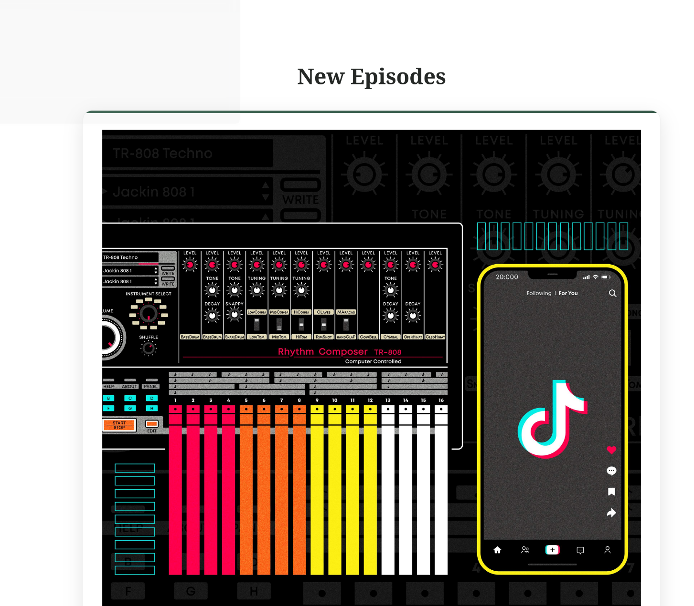

# Звіт з лабораторної роботи 4

## Реалізація бази даних для вебпроєкту

### Інформація про команду
- Назва команди:

- Учасники:
  - Панасюк Владислав Васильович (team leader / backend)
  - Пінкевич Артем Романович (frontend)
  - Морозюк Микола Володимирович (frontend)

## Завдання

### Обрана предметна область

PodGen is a podcast episodes generator service. Users can create podcast episodes, fetch a list of episodes, auto-generate alternative titles or descriptions via LLM, integrate external episodes via RSS.

### Реалізовані вимоги

Вкажіть, які рівні завдань було виконано:

- [ + ] Рівень 1: Створено базу даних SQLite з таблицею для відгуків, реалізовано базові CRUD операції, створено адмін-панель для перегляду та видалення відгуків, додано функціональність магазину з таблицями для товарів та замовлень
- [ + ] Рівень 2: Створено додаткову таблицю, релевантну предметній області, реалізовано роботу з новою таблицею через адмін-панель, інтегровано функціональність у застосунок
- [ + ] Рівень 3: Розширено функціональність двома додатковими функціями, що суттєво покращують користувацький досвід

## Хід виконання роботи

### Підготовка середовища розробки

Опишіть процес налаштування:

- Версія Python (>=3.9,<4.0)
- Встановлені бібліотеки (FastAPI, SQLModel, Uvicorn, Asyncpg, Groq, langchain-groq, beautiful-soup 4, lxml, aiohttp)
- Інші використані інструменти та розширення (Docker, UV, mkDocs)

### Структура проєкту

Наведіть структуру файлів та директорій вашого проєкту:

<<<<<<< HEAD
```
  .
  ├── compose.yaml
  ├── Dockerfile
  ├── docs
  │   ├── images
  │   │   ├── alt-command-bot.png
  │   │   ├── get-podcast-episodes-not-found.png
  │   │   ├── get-podcast-episodes.png
  │   │   ├── get-rss-fetch.png
  │   │   ├── post-podcast-episodes-id-generate_alternative.png
  │   │   ├── post-podcast-episodes.png
  │   │   ├── post-rss-post-not-found.png
  │   │   ├── post-rss-post.png
  │   │   ├── post-webhook-episodes-event.png
  │   │   └── post-webhook-episodes-event-telegram.png
  │   ├── installation.md
  │   └── report.md
  ├── LICENSE
  ├── mkdocs.yml
  ├── pyproject.toml
  ├── pytest.ini
  ├── README.md
  ├── scripts
  │   ├── build.sh
  │   ├── clean.sh
  │   └── run.sh
  ├── src
  │   ├── app
  │   │   ├── api
  │   │   │   ├── api.py
  │   │   │   ├── dependencies.py
  │   │   │   ├── __init__.py
  │   │   │   └── routes
  │   │   │       ├── __init__.py
  │   │   │       ├── podcast.py
  │   │   │       └── rss.py
  │   │   ├── core
  │   │   │   ├── config.py
  │   │   │   ├── db
  │   │   │   │   ├── database.py
  │   │   │   │   └── __init__.py
  │   │   │   ├── __init__.py
  │   │   │   ├── logger.py
  │   │   │   ├── models
  │   │   │   │   ├── podcast.py
  │   │   │   │   └── rss.py
  │   │   │   └── services
  │   │   │       ├── groq.py
  │   │   │       └── __init__.py
  │   │   ├── crud
  │   │   │   ├── base_crud.py
  │   │   │   ├── __init__.py
  │   │   │   ├── podcast_crud.py
  │   │   │   └── rss_crud.py
  │   │   ├── __init__.py
  │   │   ├── main.py
  │   │   ├── static
  │   │   │   ├── assets
  │   │   │   │   ├── about-1.jpg
  │   │   │   │   ├── about-2.jpg
  │   │   │   │   └── bg.jpg
  │   │   │   └── css
  │   │   │       └── styles.css
  │   │   └── templates
  │   │       ├── about.html
  │   │       ├── base.html
  │   │       ├── components
  │   │       │   ├── header.html
  │   │       │   ├── notFound.html
  │   │       │   ├── podcast
  │   │       │   │   ├── create_alternative_episode.html
  │   │       │   │   ├── create_episode.html
  │   │       │   │   └── list_episodes.html
  │   │       │   ├── rss
  │   │       │   │   ├── feed.html
  │   │       │   │   └── feeds.html
  │   │       │   └── successful.html
  │   │       └── home.html
  └── uv.lock
```
=======
.
├── compose.yaml
├── Dockerfile
├── docs
│   ├── images
│   │   ├── alt-command-bot.png
│   │   ├── get-podcast-episodes-not-found.png
│   │   ├── get-podcast-episodes.png
│   │   ├── get-rss-fetch.png
│   │   ├── post-podcast-episodes-id-generate_alternative.png
│   │   ├── post-podcast-episodes.png
│   │   ├── post-rss-post-not-found.png
│   │   ├── post-rss-post.png
│   │   ├── post-webhook-episodes-event.png
│   │   └── post-webhook-episodes-event-telegram.png
│   ├── installation.md
│   └── report.md
├── LICENSE
├── mkdocs.yml
├── pyproject.toml
├── pytest.ini
├── README.md
├── scripts
│   ├── build.sh
│   ├── clean.sh
│   └── run.sh
├── src
│   ├── app
│   │   ├── api
│   │   │   ├── api.py
│   │   │   ├── dependencies.py
│   │   │   ├── __init__.py
│   │   │   └── routes
│   │   │       ├── __init__.py
│   │   │       ├── podcast.py
│   │   │       └── rss.py
│   │   ├── core
│   │   │   ├── config.py
│   │   │   ├── db
│   │   │   │   ├── database.py
│   │   │   │   └── __init__.py
│   │   │   ├── __init__.py
│   │   │   ├── logger.py
│   │   │   ├── models
│   │   │   │   ├── podcast.py
│   │   │   │   └── rss.py
│   │   │   └── services
│   │   │       ├── groq.py
│   │   │       └── __init__.py
│   │   ├── crud
│   │   │   ├── base_crud.py
│   │   │   ├── __init__.py
│   │   │   ├── podcast_crud.py
│   │   │   └── rss_crud.py
│   │   ├── __init__.py
│   │   ├── main.py
│   │   ├── static
│   │   │   ├── assets
│   │   │   │   ├── about-1.jpg
│   │   │   │   ├── about-2.jpg
│   │   │   │   └── bg.jpg
│   │   │   └── css
│   │   │       └── styles.css
│   │   └── templates
│   │       ├── about.html
│   │       ├── base.html
│   │       ├── components
│   │       │   ├── header.html
│   │       │   ├── notFound.html
│   │       │   ├── podcast
│   │       │   │   ├── create_alternative_episode.html
│   │       │   │   ├── create_episode.html
│   │       │   │   └── list_episodes.html
│   │       │   ├── rss
│   │       │   │   ├── feed.html
│   │       │   │   └── feeds.html
│   │       │   └── successful.html
│   │       └── home.html
└── uv.lock

>>>>>>> refs/remotes/origin/master

### Проектування бази даних

#### Схема бази даних

Опишіть структуру вашої бази даних:

```
Таблиця "podcasts":
- id (INTEGER, PRIMARY KEY)
- title (TEXT, NOT NULL)
- description (TEXT, NOT NULL)
- host (TEXT, NOT NULL)
```

### Опис реалізованої функціональності

#### Generate text using a Groq (LPU)

Можна змінити topic / description подкасту використовуючи найшвидший Language Processing Unit (LPU). В даному проєкті було використано `llama-3.3-70b-versatile` модель, яка забезпечує гнучкіть та креативніть регеренування тексту.

#### News RSS 

Було задієно бібліотеку BeautifulSoup4 та aiohttp, щоб получити код xml та зчитування подкастів.

#### PodGen

Опишіть функціональність PodGen:

- Відображення "Головної" та сторінки "Про нас"
- Додавання / видалення подкастів
- Regenerate подкасту
- Витягування з RSS подкасти
- Інтерактивний дизайн

## Ключові фрагменти коду

### Ініціалізація бази даних

Наведіть код створення таблиць у файлі `models.py`:

```python
# Third-party Dependencies
from sqlalchemy.ext.asyncio import (
    AsyncSession,
    async_sessionmaker,
    create_async_engine
)

# Local Dependencies
from core.config import DB_URL

# Create an async engine instance
async_engine = create_async_engine(DB_URL, echo=True, pool_pre_ping=True)

# Create a reusable Session class for consistent database interactions 
async_session = async_sessionmaker(
    async_engine,
    class_=AsyncSession,
    expire_on_commit=False,
    autoflush=False
)
```

### CRUD операції

Наведіть приклади реалізації CRUD операцій:

- base_crud.py
```python
from typing import List
import warnings

# Third-party Dependencies
from sqlmodel.ext.asyncio.session import AsyncSession
from sqlalchemy import select

# Local Dependencies
from core.config import TypeSQL
from core.logger import logger

class BaseCRUD:
    def __init__(self, session: AsyncSession):
        self.session = session

    async def create(
        self,
        obj: type[TypeSQL],
    ) -> TypeSQL:
        """
        Create an object.
        """
        self.session.add(obj)
        await self.session.commit()
        await self.session.refresh(obj)
        return obj

    async def read_all(
            self,
            obj: type[TypeSQL],
            **kwargs,
        ) -> List[type[TypeSQL]]:
        """
        Read all objects from the table.
        """
        offset, limit = kwargs.get("offset"), kwargs.get("limit")
        statement = select(obj).offset(offset).limit(limit)
        result = await self.session.execute(statement)
        return result.scalars().all()
```

- podcast_crud.py
```python
from sqlmodel import select

# Local Dependencies
from .base_crud import BaseCRUD
from core.models.podcast import (
    PodcastEpisodeBase,
    PodcastEpisode
)

class PodcastCRUD(BaseCRUD):
    def __init__(self, session):
        super().__init__(session)

    async def read_by_id(self, id: int) -> PodcastEpisodeBase:
       """
       Fetch the podcast using its `id`.
       """
       statement = select(PodcastEpisode).where(PodcastEpisode.id == id)
       result = await self.session.execute(statement)
       return result.scalar_one_or_none()
    
    async def update(self, id: int, data: dict) -> PodcastEpisodeBase:
        """
        Update a podcast episode by id.
        """
        result = await self.session.execute(select(PodcastEpisode).where(PodcastEpisode.id == id))
        episode = result.scalar_one_or_none()
        if not episode: 
            return None
        for key, value in data.items():
            if hasattr(episode, key):
                setattr(episode, key, value)
        self.session.add(episode)
        await self.session.commit()
        await self.session.refresh(episode)

        return episode

    async def remove_by_id(self, id: int):
      """
      Delete a podcast episode by id.
      """
      statement = select(PodcastEpisode).where(PodcastEpisode.id == id)
      result = await self.session.execute(statement)
      instance = result.scalar_one_or_none()
      if instance:
        await self.session.delete(instance)
        await self.session.commit()
      else:
        return None
```

- rss_crud.py
```python
from typing import List

# Local Dependencies
from . import BaseCRUD
from core.models.rss import RssFeed
import aiohttp

from bs4 import (
  BeautifulSoup,
  XMLParsedAsHTMLWarning
)
import warnings

class RssCRUD(BaseCRUD):
    def __init__(self, session):
        super().__init__(session)

    @classmethod
    def safe_extract(cls, item, tag_name:str, default=""):
       tag = item.find(tag_name)
       return tag.get_text(strip=True) if tag else default

    @classmethod
    async def extract_soup(cls, url:str) -> BeautifulSoup:
      headers = {"User-Agent": "Mozilla/5.0 (compatible; MyPodcastFetcher/1.0; +https://example.com"}

      async with aiohttp.ClientSession() as session:
        async with session.get(url, headers=headers) as response:
          content = await response.text()

      warnings.filterwarnings("ignore", category=XMLParsedAsHTMLWarning)
      soup = BeautifulSoup(content, "lxml-xml")
      return soup

    @classmethod
    async def fetch_all(
        cls,
        *,
        url: str,
        **kwargs,
    ) -> List[RssFeed]:
        """
        Fetch all RSS feeds from URL.
        """
        offset = kwargs.get("offset", 0)
        limit = kwargs.get("limit", None)


        # Extract from xml
        soup = await cls.extract_soup(url)

        feeds = []
        author_elem = soup.find("itunes:author")
        author = author_elem.text.strip()
        for item in soup.find_all("item"):
          title = cls.safe_extract(item, "title")
          description = cls.safe_extract(item, "description")
          pub_date = cls.safe_extract(item, "pubDate")
          origin = cls.safe_extract(item, "link")
          uuid = cls.safe_extract(item, "guid")

          image_url = ""
          itunes_img = item.find("itunes:image")
          if itunes_img and itunes_img.get("href"):
            image_url = itunes_img["href"]
          else:
            media_thumb = item.find("media:thumbnail")
            if media_thumb and media_thumb.get("url"):
              image_url = media_thumb["url"]

          if title:
             feeds.append(
                RssFeed(
                   image_url=image_url,
                   title=title,
                   description=description,
                   author=author,
                   date=pub_date,
                   origin=origin,
                   uuid=uuid
                )
             )
              
        feeds = feeds[offset:]
        return feeds[:limit] if limit else feeds
```

#### Створення (Create)

```python
@asynccontextmanager
async def lifespan(app: FastAPI):
    # Create the database tables
    async with async_engine.begin() as conn:
        await conn.run_sync(SQLModel.metadata.create_all)
    yield
    await async_engine.dispose()
```

### Маршрутизація

Наведіть приклади маршрутів для роботи з базою даних:

```python
@router.post("/episodes/{episode_id}/generate_alternative",
  response_model=PodcastEpisodeAlternative,
  status_code=status.HTTP_200_OK)
async def get_alternative_episode(
    request: Request,
    episode_id: Annotated[int, Path()],
    target: Annotated[Literal["title", "description"], Form()],
    prompt: Annotated[str, Form()],
    session: AsyncSessionDep
):
    """
    Generate an alternative version of the episode.
    """
    result = await PodcastCRUD(session).read_by_id(episode_id)
    if not result:
      return template.TemplateResponse(
        request=request,
        name="components/notFound.html",
        context={
          "title": settings.NAME
        }
      )
    origional_episode = PodcastEpisodeBase.model_validate(result)

    groq = GroqClient(
        model=settings.GROQ_MODEL,
    ).create_template(
        prompt=f"{settings.GROQ_MODEL_TEMPLATE}. Prompt: {prompt}."
    )

    field_value = getattr(origional_episode, target)
    generated_alternative = await groq.ask(field_value)

    if not await PodcastCRUD(session).update(
      episode_id,
      data={
        target: str(generated_alternative)
      }
    ):
      return template.TemplateResponse(
        request=request,
        name="components/notFound.html",
        context={
          "title": settings.NAME
        }
      )

    return RedirectResponse(f"/podcast/episodes/all", status_code=status.HTTP_303_SEE_OTHER)
```

## Розподіл обов'язків у команді

Опишіть внесок кожного учасника команди:

- Панасюк Владислав Васильович: (Api Routes, dependencies, Database (PostgreSQL), (scripts).sh, CRUD, Docker, UV)
- Пінкевич Артем Романович: (html / css, javascript, js libs, animations)

## Скріншоти

Додайте скріншоти основних функцій вашого вебзастосунку:

### Swagger Docs


### Create an Episode


### Episode list


### Generate altenative episode 


### News RSS 



## Тестування

### Сценарії тестування

Опишіть, які сценарії ви тестували:

1. Додавання / видалення епізоду
2. Generate alternative episode
3. Парсинг News RSS
4. Додавання RSS Feed в базу даних
5. Перевірка валідації даних


## Висновки

Опишіть:

- Що вдалося реалізувати успішно: Успішно вдалося реазілувати API з HTML (css). Підклювання бази даних, валідацію даних.
- Які навички роботи з базами даних отримали: Робота з SQL запитами (ключами)
- Які труднощі виникли при проектуванні схеми БД: Ніяких
- Як організували командну роботу: Я - Панасюк Владислав, як team lead команди наполягав у створенні хорошого продукту, який може використовуватися в подальших проєктах, як Template
- Які покращення можна внести в майбутньому: добавлення нових path operation, OAuth2, Redis 

Очікувана оцінка: 12

Обґрунтування: У цьому проєкті було задієно дві особи, яки з легікістю змогли впоратися з складним завдання, а саме проєктування PodGen, який використовує cutting-edge технології. Наприклад: UV, Docker, FastAPI, PostgreSQL (Supabase), async, Groq, Scroll Reveal.
Також було використано ООП, яке було задієно при проєктуванні Groq.

- Що навчився Артем Пінкевич:
  Ще краще орієнтуватись у GitHub, тепер маючи навичку створення вилок з гілок та можливості merge, Розробці FrontEnd для сайтів з API, Розгортанню Docker на Windows, Ефективно розподіляти сайт по багатьом HTML файлам та працювати з різними CSS та HTML функціями